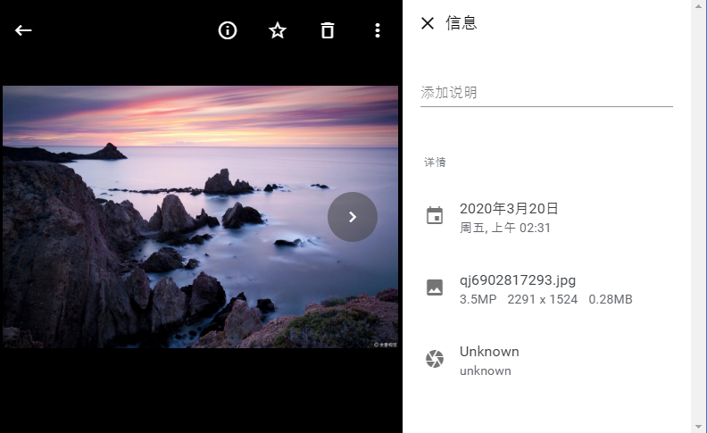

# 照片管家
可本地部署的照片管理服务，可设备照片同步、重复照片处理

## 怎样运行
下载源代码后，本地执行maven 打包
```shell script
mvn clean package
```

运行
```shell script
java -cp core.jar io.tony.photo.App [文件保存目录]
```

## 功能列表
- [DONE] 照片列表
- [DONE] 照片上传、删除、创建相册、收藏
- [DONE] 相册列表
- [DONE] 按日期、地点聚合
- [DONE] 收藏列表、已删除列表
- [DONE] 基于文件MD5做图片去重
- [TODO] 相册名称修改、封面修改、删除相册
- [TODO] 网盘接入
- [TODO] 多设备同步工具（Android、Ios）


# 截图

- 照片列表


- 照片大图查看


- 相册


- 菜单


